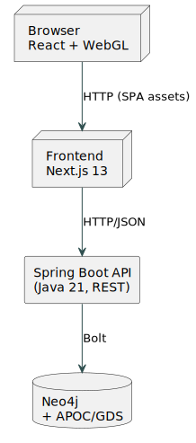

# 🧠 Social Network Visualizer

**Social Network Visualizer** is a web-based tool for **importing, analysing, and interactively visualising** relationships between social-media users (e.g. Twitter/X).  
Everything runs **locally in Docker** – one command spins up the backend, frontend, and Neo4j graph database.

---

## 🎯 Project Goals

| Goal | Description |
|------|-------------|
| **Offline data import** | Accepts `.json` files shaped like a Twitter/X API export (tweets, users, metadata). |
| **Graph-native storage** | Maps raw tweets into nodes (users, tweets, hashtags) and edges (mentions, retweets, replies). |
| **Fast SNA analytics** | Built-in centrality metrics, community detection (Label Propagation), influencer ranking. |
| **WebGL graph** | React/Next.js frontend powered by `react-force-graph` (2D/3D) – smooth even with > 1 M edges. |
| **Dashboards & reports** | Global stats, activity heat-maps, user/community drill-downs; PDF/CSV export (road-mapped). |
| **Zero-code UX** | From _import → pick relation → explore_ in a few clicks – no scripting required. |

---

## 🏗️ High-Level Architecture



A web application for visualizing user interactions from social media platforms using a graph-based approach. The system consists of a Spring Boot backend, a Next.js frontend, and a Neo4j graph database — all containerized with Docker.

---

## 🎥 Project Demo

https://github.com/user-attachments/assets/4c27ede3-2f2c-4523-b3a8-8b546452f29f


---


## 🛠️ Requirements

- Docker and Docker Compose installed
- Docker Engine running in the background


---
## 🚀 Running the Application

Go to the project root directory:

```bash
cd social-network-visualizer
```

Then run all containers:

```bash
docker-compose up --build
```


Or, if the images are already built:

```bush
docker-compose up
```

## Accessing the Application
Backend: http://localhost:8080/

Frontend: http://localhost:3000


## 📸 Snapshot Disclaimer
This public repository contains a **read-only snapshot** of the project code-base  
(`main` branch, commit _<YYYY-MM-DD>_).  
Active development continues in a **private repo**, so pull requests will not be merged here.  
Feel free to browse the code, raise issues, or reach out if you have questions.


## 👥 Authors & Acknowledgements
| GitHub Handle | Name | Role |
|---------------|------|------|
| [@daredevilq](https://github.com/daredevilq)| Piotr Śmiałek | full-stack |
| [@TommyFurgi](https://github.com/TommyFurgi) | Tomasz Furgała |  full-stack|
| [@WiktorDybalski](https://github.com/WiktorDybalski)| Wiktor Dybalski | full-stack|
